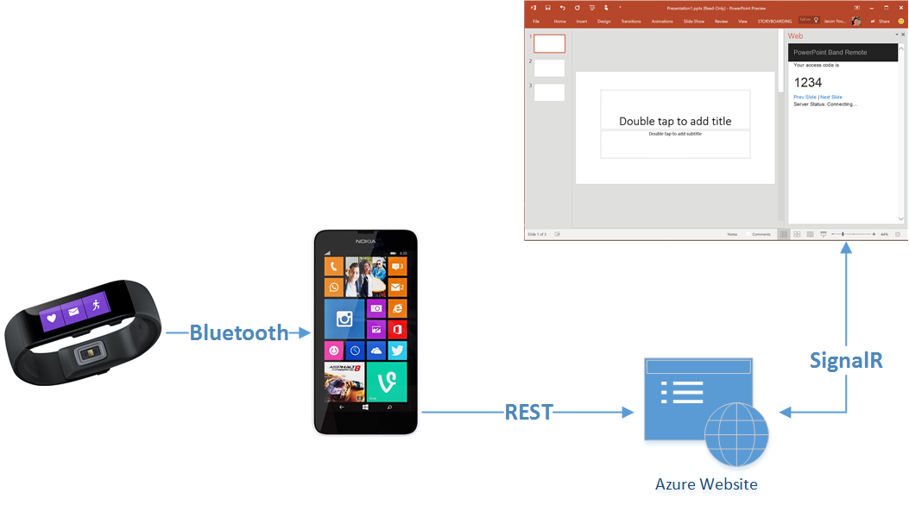

# band-powerpoint-remote

A prototype for interpreting gestures from the band and advancing PowerPoint slides. This project contains the phone application.

Data from the gyroscope is processed using Reactive Extensions within the [Band Stream Processor](https://github.com/ytechie/band-stream-processor).

The resulting next/prev commands are sent to a [WebAPI and PowerPoint web proxy](https://github.com/ytechie/powerpoint-remote-proxy).

## License

Microsoft Developer Experience & Evangelism

Copyright (c) Microsoft Corporation. All rights reserved.

THIS CODE AND INFORMATION ARE PROVIDED "AS IS" WITHOUT WARRANTY OF ANY KIND, EITHER EXPRESSED OR IMPLIED, INCLUDING BUT NOT LIMITED TO THE IMPLIED WARRANTIES OF MERCHANTABILITY AND/OR FITNESS FOR A PARTICULAR PURPOSE.

The example companies, organizations, products, domain names, e-mail addresses, logos, people, places, and events depicted herein are fictitious. No association with any real company, organization, product, domain name, email address, logo, person, places, or events is intended or should be inferred.
